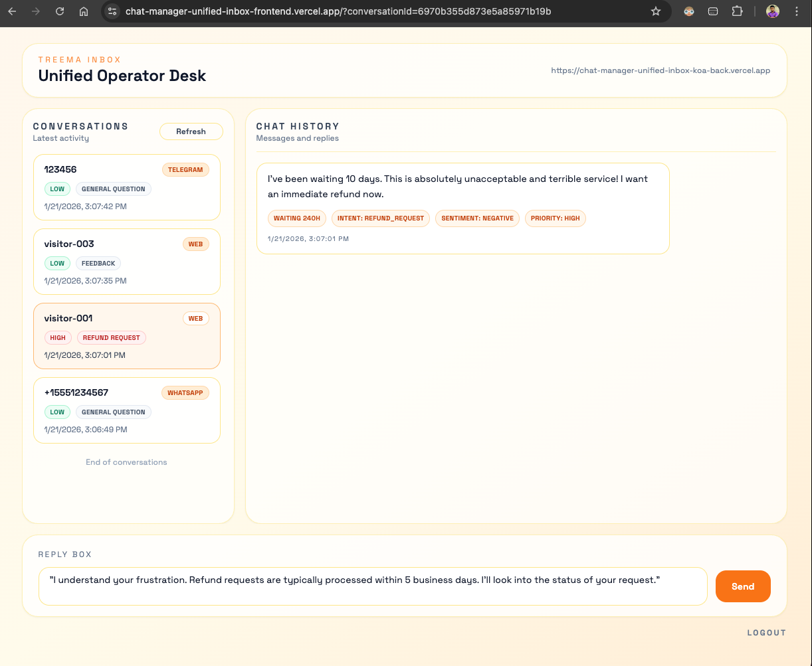
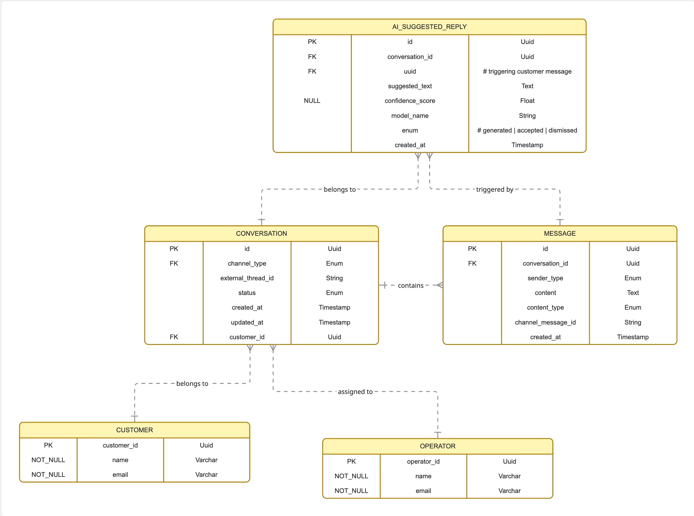
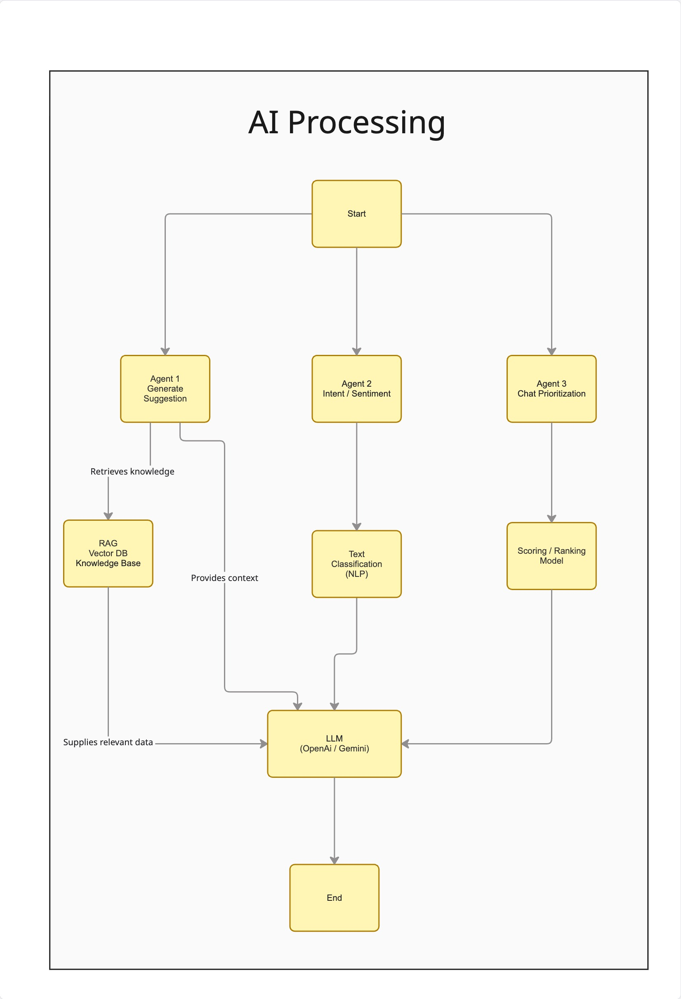
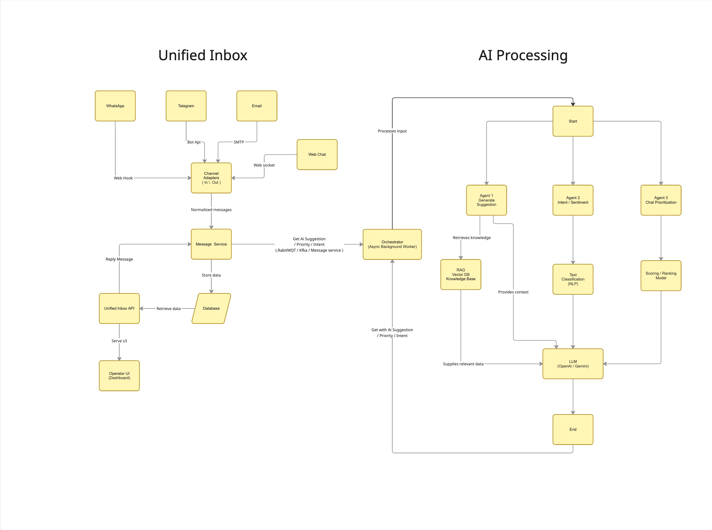

## Hello AI – Multi-Channel Chat Management & Intelligence System

Unified inbox for consolidating messages from multiple channels (WhatsApp, Telegram, Email, Web chat). Messages are normalized into a single schema, enriched via the AI analysis API, and displayed in an operator-friendly UI with reply tools.

🔗 **[Demo https://chat-manager-unified-inbox-frontend.vercel.app](https://chat-manager-unified-inbox-frontend.vercel.app)**



## This is the architecture of Unified inbox system.

First, each channel connects through a **Channel Adapter**.  
Incoming messages—regardless of their source—are routed through the **Message Service**, where they are **normalized into a common internal format** and stored as part of a **conversation** in the database.

Operators interact with the system through a single UI. The UI fetches conversation data via APIs, which call the **Message Service** to retrieve messages from the database.

When an operator sends a reply, the message is submitted through the API to the **Message Service**, which updates the database and then routes the message through the appropriate **Channel Adapter** to deliver it back to the original channel.
 


## Database achitecture 
This data model supports a multi-channel **Unified Inbox** where customer conversations from different channels (e.g., WhatsApp, Email, Web Chat) are normalized into a single internal structure.  
It is designed to clearly separate core messaging data from AI-generated insights while maintaining full traceability and auditability.

1. A customer message is received and stored in the `message` table.
2. The message is processed asynchronously by the AI service.
3. Suggested replies are generated and stored in `ai_suggested_reply`.



## AI Processing Architecture

This diagram illustrates the AI processing layer used in the Unified Inbox to enhance operator efficiency through automation, insights, and prioritization.    

 


This diagram represents a Supervisor–Agent based AI processing architecture where multiple AI agents work in parallel and feed a central LLM to produce intelligent outcomes.

### **Agent 1: AI Reply Generation**

Generates context-aware reply suggestions for operators.
**Flow:**
1.  Retrieves relevant information from the **RAG Vector Database / Knowledge Base**
2.  Supplies relevant data and contextual grounding to the LLM
3.  Invokes the **LLM (OpenAI / Gemini)** to generate response suggestions    
4.  Outputs safe, context-aware reply suggestions for operator review
----------

### **Agent 2: Intent & Sentiment Detection**
Understands the customer’s intent and emotional tone
**Flow:**
1.  Processes the incoming message using **NLP-based text classification**  
2.  Detects intent (e.g., inquiry, complaint, follow-up)
3.  Identifies sentiment (positive, neutral, negative)
4.  Sends structured intent and sentiment signals to the LLM to guide response tone and handling
----------

### **Agent 3: Chat Prioritization**
Determines which conversations require immediate attention.
**Flow:**
1.  Applies a **scoring / ranking model**
2.  Considers factors such as:
    -   Identified intent
    -   Message urgency  
3.  Produces a priority score that is fed into the LLM for informed decision-making

----------

### **Central LLM (OpenAI / Gemini)**
The LLM acts as the **fusion layer**, combining:
-   Retrieved knowledge from RAG
-   Intent and sentiment insights
-   Conversation priority signals
It generates final AI-assisted outputs aligned with context, emotion, and urgency.


## Unified Inbox ↔ AI Processing Connector (Worker Module)

The Unified Inbox and AI Processing systems are connected through an **asynchronous Worker (Orchestrator)** module.  
This module acts as a decoupled bridge between message ingestion and AI computation.



### Connection Flow (High-Level)

1. A message is received and normalized by the **Channel Adapters**
2. The **Message Service** stores the message in the database
3. An event is published to the **Worker queue** (e.g., RabbitMQ / Kafka)
4. The **Worker (Orchestrator)** consumes the event asynchronously
5. The Worker invokes the **AI Processing layer**
6. AI results (suggested replies, intent, priority) are returned
7. The Worker stores AI outputs back into the database
8. The **Unified Inbox API** exposes enriched data to the Operator UI
 
This connector pattern enables production-ready extensibility while keeping system boundaries clear.


## Tech Stack

**Frontend**
- React (Vite)
- Tailwind CSS

**Backend**
- Node.js, Koa
- MongoDB + Mongoose
- JWT (httpOnly cookies) for auth

**AI Analysis API**
- Python, FastAPI (Uvicorn)
- LangGraph + Gemini (LLM)
- Chroma/FAISS (vector store), TextBlob (sentiment)

## Repository Structure

- `frontend/` – React admin console
- `backend/` – Koa API, webhooks, auth, analysis enrichment
- `treema-Ai/` – AI analysis service

## Setup

### 1) Backend

Create `backend/.env`:

```
PORT=3000
MONGODB_URI=mongodb://localhost:27017/treema_unified_inbox

AI_END_URI=http://127.0.0.1:8000
AI_API_KEY=your_api_key_here

JWT_SECRET=change_me
AUTH_EMAIL=
AUTH_PASSWORD=

RATE_LIMIT_MAX=100
RATE_LIMIT_WINDOW_MS=3600000

CORS_ORIGIN=http://localhost:5173
```

Run:

```
cd backend
npm install
npm run dev
```

### 2) Frontend

Create `frontend/.env`:

```
VITE_API_BASE=http://localhost:3000
```

Run:

```
cd frontend
npm install
npm run dev
```

### 3) AI Analysis API

Create `treema-Ai/.env`:

```
GOOGLE_API_KEY=your_key_here
AI_API_KEY=your_api_key_here
LLM_ENABLED=true
```

Run (local, no Docker):

```
cd treema-Ai
uv venv
uv pip install -r requirement.txt
source .venv/bin/activate
uvicorn app.api:app --reload
```

Run (Docker):

```
cd treema-Ai
docker build -t treema-ai .
docker run --rm -p 8000:8000 -e GOOGLE_API_KEY=your_key_here -e AI_API_KEY=your_api_key_here treema-ai
```

## Useful Endpoints

- `POST http://localhost:3000/webhooks/whatsapp`
- `POST http://localhost:3000/webhooks/telegram`
- `POST http://localhost:3000/webhooks/email`
- `POST http://localhost:3000/webhooks/webchat`
- `GET  http://localhost:3000/conversations?limit=5&offset=0`
- `GET  http://localhost:3000/conversations/:id/messages?limit=5`
- `POST http://localhost:3000/reply`
- `POST http://localhost:3000/auth/login`
- `GET  http://localhost:3000/auth/me`
- `POST http://localhost:3000/auth/logout`

